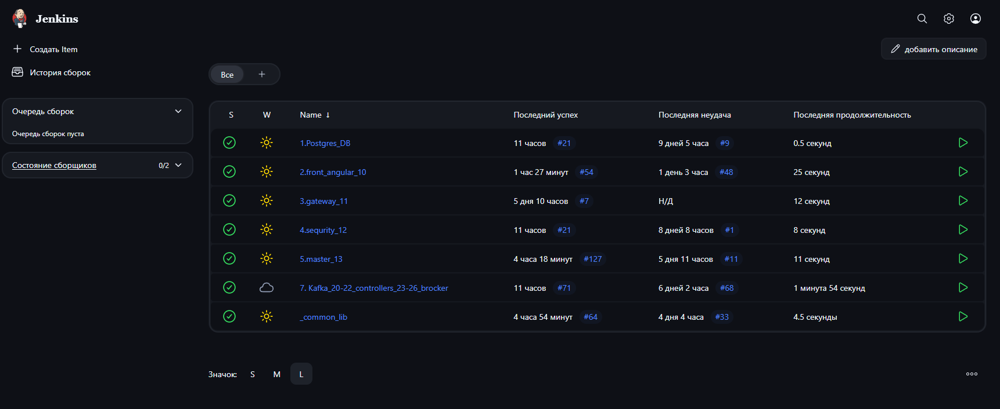

# Projects **JavaBruse**

> Каждый микросервис запускается в своем докер контенере в отдельной сети Docker и выполняет отведенную для себя роль.
> В системе используется брокер сообщений Apache Kafka, что позволяет масштабироваться горизонтально и множить сервисы анализа исходя из нагрузки

---

## Оригинальный репозиторий

- [Микросервис Master](https://github.com/JavaBruse/hackaton-master.git) Master Service
- [Микросервис Library entity](https://github.com/JavaBruse/hackaton-common-lib.git) Library Entity and Repo
- [Микросервис Front](https://github.com/JavaBruse/hackaton-front.git) Frontend Angular TS
- [Микросервис Security](https://github.com/JavaBruse/hackaton-security.git) Spring Security
- [Микросервис Gateway](https://github.com/JavaBruse/hackaton-gateway.git) Spring GateWay

---

## Ко всему прочему, на мощностях провайдера сервера взято в аренду хранилище S3

## Основные этапы

### 1. Jenkins CI/CD



### Рекомендуемый порядок запуска:
1. Postgres
2. Kafka
3. common_lib
4. security
5. master
6. gateway
7. front
- Для настройки и установки используем этот скрипт:

```shell
#!/bin/bash

# Устанавливаем Docker
apt-get update
apt-get install ca-certificates curl
install -m 0755 -d /etc/apt/keyrings
curl -fsSL https://download.docker.com/linux/debian/gpg -o /etc/apt/keyrings/docker.asc
chmod a+r /etc/apt/keyrings/docker.asc

echo \
  "deb [arch=$(dpkg --print-architecture) signed-by=/etc/apt/keyrings/docker.asc] https://download.docker.com/linux/debian \
  $(. /etc/os-release && echo "$VERSION_CODENAME") stable" | \
tee /etc/apt/sources.list.d/docker.list > /dev/null
apt-get update

apt-get install docker-ce docker-ce-cli containerd.io docker-buildx-plugin docker-compose-plugin
systemctl start docker


# Добавляем текущего пользователя в группу docker (чтобы не использовать sudo)
usermod -aG docker $USER

# Устанавливаем haproxy
ставим хап прокси
apt install haproxy -y

# Настраиваем UFW (брандмауэр)
apt install ufw
ufw allow OpenSSH
ufw allow 8080
ufw allow 9092
ufw allow 1818
ufw allow 80
ufw --force enable

# Ставим NodeJs and Angular
curl -fsSL https://deb.nodesource.com/setup_22.x | sudo bash -
apt-get install -y nodejs
npm install -g @angular/cli

# Устанавливаем Jenkins
apt install fontconfig openjdk-21-jre
wget -O /etc/apt/keyrings/jenkins-keyring.asc \
  https://pkg.jenkins.io/debian-stable/jenkins.io-2023.key
echo "deb [signed-by=/etc/apt/keyrings/jenkins-keyring.asc]" \
  https://pkg.jenkins.io/debian-stable binary/ | sudo tee \
  /etc/apt/sources.list.d/jenkins.list > /dev/null
apt-get update
apt-get install jenkins
systemctl enable jenkins
systemctl start jenkins

# Добавляем пользователя jenkins в группу docker
usermod -aG docker jenkins

# Перезапускаем сервисы для применения изменений
systemctl restart jenkins
systemctl restart docker

# Показываем пароль администратора Jenkins
echo "Jenkins initial admin password:"
cat /var/lib/jenkins/secrets/initialAdminPassword
```

Конфиг Haproxy /etc/haproxy/haproxy.cfg

```conf
Для Kafka (TCP)
frontend kafka_front
bind *:9092
mode tcp
default_backend kafka_cluster

backend kafka_cluster
mode tcp
balance leastconn
server broker1 172.20.0.23:19092 check
server broker2 172.20.0.24:19092 check
server broker3 172.20.0.25:19092 check

# Для веба (HTTP)
# Для фронта (HTTP)
frontend web_front
bind *:80
default_backend frontend_servers

backend frontend_servers
server frontend 172.20.0.20:80

# Для бэкенда (HTTP)
frontend api_front
bind *:1818
default_backend backend_servers

backend backend_servers
server backend 172.20.0.30:8080
```

---

## Job в Jenkins на каждый сервис:

### Postgres_DB

```shell
# Название сети
NETWORK_NAME="app_network"
# Проверяем, существует ли сеть
NETWORK_EXISTS=$(docker network ls --filter name=$NETWORK_NAME -q)
# Если сети нет, создаём её
if [ -z "$NETWORK_EXISTS" ]; then
 echo "Сеть $NETWORK_NAME не существует. Создаём..."
 docker network create --driver bridge --subnet 172.20.0.0/16 $NETWORK_NAME
else
 echo "Сеть $NETWORK_NAME уже существует."
fi

CONTAINER_NAME="postgres-db"
if docker ps -a --filter "name=$CONTAINER_NAME" --format "{{.Names}}" | grep -q "$CONTAINER_NAME"; then
 docker stop $CONTAINER_NAME
 docker rm $CONTAINER_NAME
fi
docker run --name $CONTAINER_NAME \
 -e POSTGRES_USER=admin \
 -e POSTGRES_PASSWORD="E2#QWDr321c%jiGHDShewfdwe" \
 -e POSTGRES_DB=hackaton \
 --network app_network \
 --ip 172.20.0.9 \
 --expose 5432 \
 --restart always \
 -d postgres:13
```

---

## Apache Kafka

```shell
# Название сети
NETWORK_NAME="app_network"
# Проверяем, существует ли сеть
NETWORK_EXISTS=$(docker network ls --filter name=$NETWORK_NAME -q)
# Если сети нет, создаём её
if [ -z "$NETWORK_EXISTS" ]; then
 echo "Сеть $NETWORK_NAME не существует. Создаём..."
 docker network create --driver bridge --subnet 172.20.0.0/16 $NETWORK_NAME
else
 echo "Сеть $NETWORK_NAME уже существует."
fi
#!/bin/bash
set -e

NETWORK_NAME="app_network"
ADMIN_USER="admin"
ADMIN_PASSWORD="2egE3f690JkejwEopij60qjnioqiowe98"

# --- Чистим старые контейнеры ---
for CONTAINER_NAME in "controller-1" "controller-2" "controller-3" "broker-1" "broker-2" "broker-3"; do
  if docker ps -a --filter "name=$CONTAINER_NAME" --format "{{.Names}}" | grep -q "$CONTAINER_NAME"; then
    docker stop $CONTAINER_NAME || true
    docker rm $CONTAINER_NAME || true
  fi
done

# --- Создаем сеть если не существует ---
docker network create --subnet=172.20.0.0/16 $NETWORK_NAME 2>/dev/null || true

# --- Запускаем контроллеры ---
for i in 1 2 3; do
  docker run --name controller-$i \
    --network $NETWORK_NAME --ip 172.20.0.$((19+i)) \
    --restart unless-stopped -d \
    -e KAFKA_NODE_ID=$i \
    -e KAFKA_PROCESS_ROLES=controller \
    -e KAFKA_LISTENERS=CONTROLLER://:9093 \
    -e KAFKA_CONTROLLER_LISTENER_NAMES=CONTROLLER \
    -e KAFKA_CONTROLLER_QUORUM_VOTERS="1@controller-1:9093,2@controller-2:9093,3@controller-3:9093" \
    apache/kafka:3.9.0
done

sleep 15

# --- Запускаем брокеры с PLAINTEXT для создания пользователя ---
for i in 1 2 3; do
  PORT=$((29092 + (i-1)*10000))
  NODE_ID=$((i+3))

  docker run --name broker-$i \
    --network $NETWORK_NAME --ip 172.20.0.$((22+i)) \
    -p $PORT:9094 \
    --restart unless-stopped -d \
    -v /opt/kafka/config/kafka_server_jaas.conf:/opt/kafka/config/kafka_server_jaas.conf \
    -e KAFKA_NODE_ID=$NODE_ID \
    -e KAFKA_PROCESS_ROLES=broker \
    -e KAFKA_LISTENERS="PLAINTEXT://:9092,SASL_PLAINTEXT://:9094" \
    -e KAFKA_ADVERTISED_LISTENERS="PLAINTEXT://broker-$i:9092,SASL_PLAINTEXT://5.129.246.42:$PORT" \
    -e KAFKA_LISTENER_SECURITY_PROTOCOL_MAP="PLAINTEXT:PLAINTEXT,SASL_PLAINTEXT:SASL_PLAINTEXT,CONTROLLER:PLAINTEXT" \
    -e KAFKA_INTER_BROKER_LISTENER_NAME=PLAINTEXT \
    -e KAFKA_SASL_ENABLED_MECHANISMS=SCRAM-SHA-256 \
    -e KAFKA_CONTROLLER_LISTENER_NAMES=CONTROLLER \
    -e KAFKA_CONTROLLER_QUORUM_VOTERS="1@controller-1:9093,2@controller-2:9093,3@controller-3:9093" \
    -e KAFKA_OPTS="-Djava.security.auth.login.config=/opt/kafka/config/kafka_server_jaas.conf" \
    apache/kafka:3.9.0
done

# --- Ждем запуск брокеров ---
echo "Ждём запуск брокеров..."
sleep 45

# --- Создаем пользователя через PLAINTEXT ---
docker exec broker-1 /opt/kafka/bin/kafka-configs.sh \
  --bootstrap-server broker-1:9092 \
  --alter --add-config "SCRAM-SHA-256=[password=$ADMIN_PASSWORD]" \
  --entity-type users --entity-name $ADMIN_USER

echo "Кластер успешно запущен!"
```

## front_angular_10

```shell
npm install
npm run build

CONTAINER_NAME="front"
if docker ps -a --filter "name=$CONTAINER_NAME" --format "{{.Names}}" | grep -q "$CONTAINER_NAME"; then
 docker stop $CONTAINER_NAME
 docker rm $CONTAINER_NAME
fi
docker compose -p $CONTAINER_NAME up --build -d
docker image prune -f
```

## gateway_11

```shell
CONTAINER_NAME="gateway"
SPRING_PROFILE="test" # Или "prod", если нужно продакшен
if docker ps -a --filter "name=$CONTAINER_NAME" --format "{{.Names}}" | grep -q "$CONTAINER_NAME"; then
 docker stop $CONTAINER_NAME
 docker rm $CONTAINER_NAME
fi
SPRING_PROFILE=$SPRING_PROFILE docker compose -p $CONTAINER_NAME up --build -d
docker image prune -f
```

## sequrity_12

```shell
CONTAINER_NAME="security"
SPRING_PROFILE="test" # Или "prod", если нужно продакшен
if docker ps -a --filter "name=$CONTAINER_NAME" --format "{{.Names}}" | grep -q "$CONTAINER_NAME"; then
 docker stop $CONTAINER_NAME
 docker rm $CONTAINER_NAME
fi
SPRING_PROFILE=$SPRING_PROFILE docker compose -p $CONTAINER_NAME up --build -d
docker image prune -f
```

## master_13

```shell
CONTAINER_NAME="master"
SPRING_PROFILE="test" # Или "prod", если нужно продакшен
if docker ps -a --filter "name=$CONTAINER_NAME" --format "{{.Names}}" | grep -q "$CONTAINER_NAME"; then
 docker stop $CONTAINER_NAME
 docker rm $CONTAINER_NAME
fi
SPRING_PROFILE=$SPRING_PROFILE docker compose -p $CONTAINER_NAME up --build -d
docker image prune -f
```

## common_lib

```shell
mvn clean install -DskipTests -Dspring.profiles.active=test
```

## 🚀 Возможные улучшения

- Разделить master service на 2, отделить от него весь функционал работы с фотографиями.
- Добавить сервис для сжатия фотографий в превью на фронт.
- Вывести сортировку и фильтры на Backend часть микросервисов, для более быстрой фильтрации на уровне базы данных и выдачи по страницам от 10 объектов на PAGE, что уменьшит нагрузку на Front и ускорит обработку большого объема фотографий
- Можно реализовать "Кластер Kubernetes" микросервисов анализа данных, для обработки 100 тысяч сообщений.
